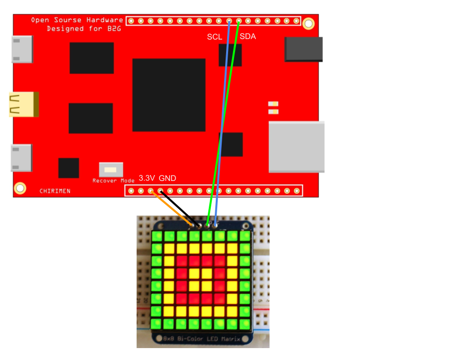

Please see also: https://github.com/club-wot/WebGPIO

## Use settings

 1. setup

```

# settings
npm i -g bower

# polyfill install
bower install

```

 2. deployment to chirimen

 3. enjoy HT16K33 (LED Backpack)

https://cdn-shop.adafruit.com/datasheets/ht16K33v110.pdf

## How to construct circuit



Japanese


